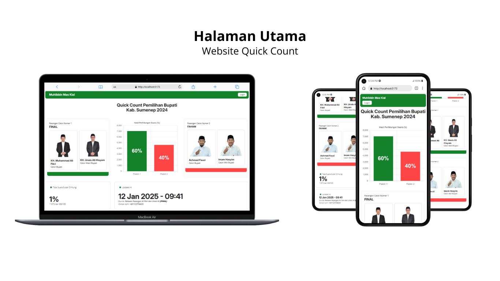
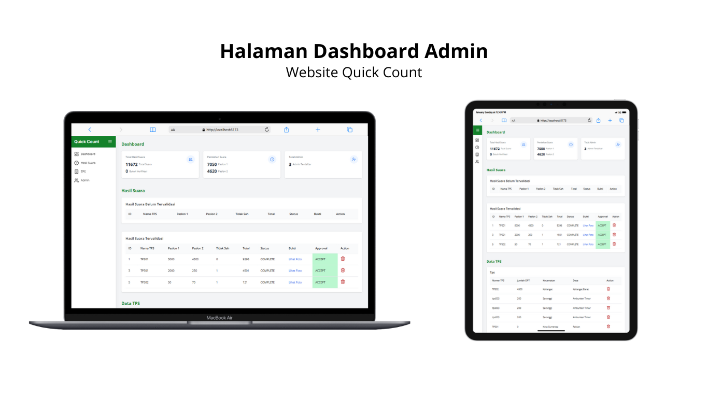
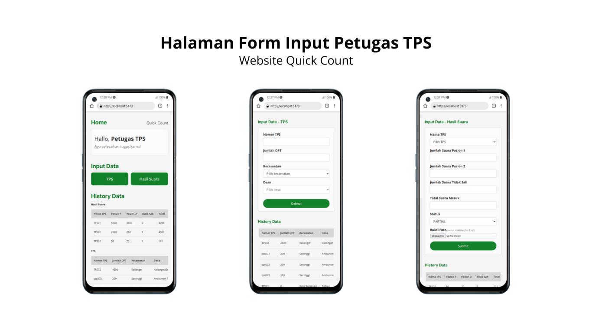
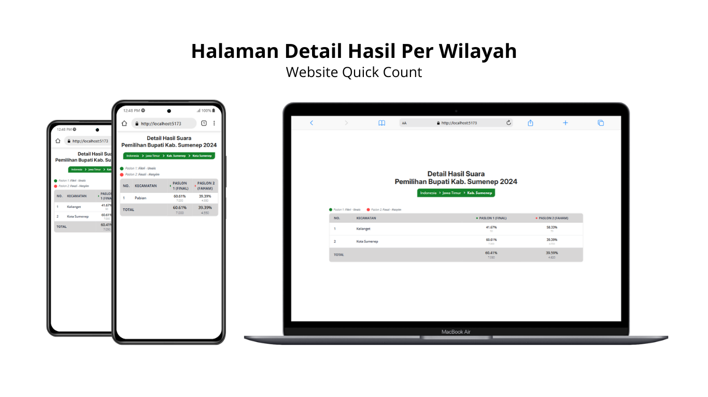

# Frontend Quick Count Sumenep

Frontend aplikasi Quick Count Pemilihan Bupati Kabupaten Sumenep 2024.

## Tech Stack

- React 18.3.1
- Redux Toolkit
- Tailwind CSS
- Axios (untuk API calls)

## Fitur

### Halaman Publik
- Visualisasi hasil quick count (bar chart)
- Persentase suara masuk dan hasil per paslon
- Detail hasil per desa dan kecamatan
- Auto-update setiap 10 menit
- Informasi waktu update terakhir

### Dashboard Admin
- Login/Logout
- Verifikasi hasil input
- Review data dan foto bukti
- Accept/Reject hasil

### Dashboard Petugas TPS
- Login/Logout
- Form input hasil perhitungan
- Upload foto bukti
- Status verifikasi

## Setup Development

1. Install dependencies
```bash
npm install
```

2. Run development server
```bash
npm run dev
```

## Environment Variables

Buat file `.env` dengan variabel berikut:

```env
VITE_API_URL="http://localhost:3001/api"
```

## State Management

- Redux Toolkit untuk global state
- useState untuk local component state
- State yang dikelola:
    - Authentication
    - Data quick count
    - Form states
    - UI states


## Tampilan Aplikasi

### Halaman Utama Quick Count

Menampilkan hasil perhitungan cepat dengan visualisasi bar chart dan persentase suara.

### Dashboard Admin

Interface untuk admin melakukan verifikasi data masuk dari petugas TPS.

### Form Input Petugas TPS

Form untuk petugas TPS menginput data hasil perhitungan suara.

### Detail Hasil Per Wilayah

Tampilan detail hasil perhitungan per desa dan kecamatan.

## Styling
Aplikasi menggunakan Tailwind CSS dengan fokus pada:
- Responsive design (mobile & desktop)
- Kemudahan penggunaan
- Visualisasi data yang jelas
- Loading states dan error handling
- Tema sesuai identitas Pemilihan Bupati Sumenep 2024
